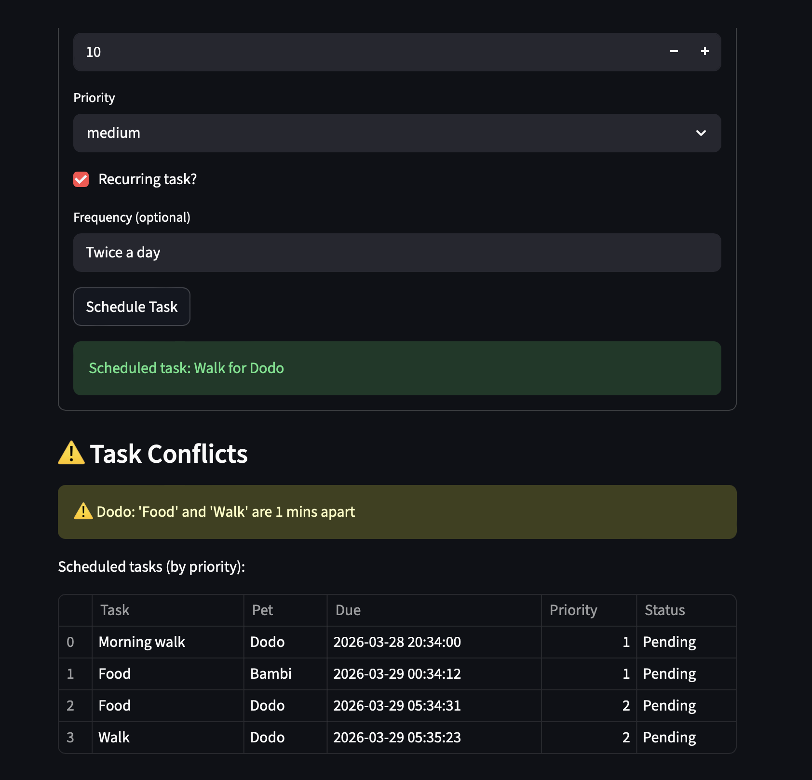
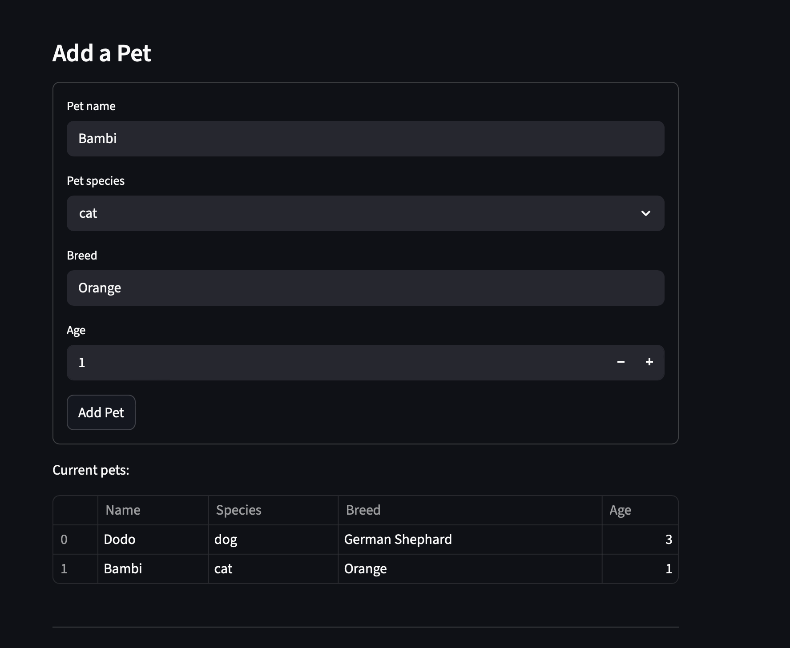
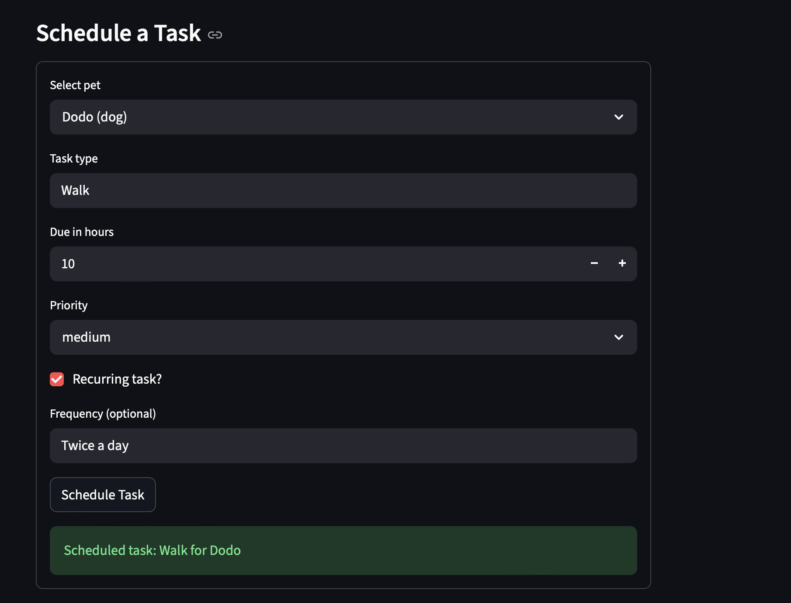

# PawPal+ (Module 2 Project)

You are building **PawPal+**, a Streamlit app that helps a pet owner plan care tasks for their pet.

## Scenario

A busy pet owner needs help staying consistent with pet care. They want an assistant that can:

- Track pet care tasks (walks, feeding, meds, enrichment, grooming, etc.)
- Consider constraints (time available, priority, owner preferences)
- Produce a daily plan and explain why it chose that plan

Your job is to design the system first (UML), then implement the logic in Python, then connect it to the Streamlit UI.

## What you will build

Your final app should:

- Let a user enter basic owner + pet info
- Let a user add/edit tasks (duration + priority at minimum)
- Generate a daily schedule/plan based on constraints and priorities
- Display the plan clearly (and ideally explain the reasoning)
- Include tests for the most important scheduling behaviors

## Getting started

PawPal+ includes intelligent scheduling algorithms:

- **Priority + Time Sorting** — tasks are ordered by due time and priority
- **Pet & Status Filtering** — view tasks for a specific pet or completion status
- **Recurring Tasks** — completed recurring tasks automatically reschedule 
  based on their frequency
- **Conflict Detection** — warns when two tasks for the same pet overlap within 30 minutes

### Testing PawPal+
- python -m pytest
-test_task_complete completing a task sets it to True
-test_scheduler_add_task adding a task increases count by 1
-test_planned_task sorting returns task ordered by due time then priority
-test_recurring_completion completing a daily recurring task creates a new task due 1 day later
-test_pets_with_no_task filtering by pets with no tasks
-tests_time_conflict two task for same pet at identical time flagged as conflic
-test_reccuring_no_frequency recurring task with no frequency = none
-test_filler_empty_scheduler filerting tasks on an empty list returns []
-test_detect_conflicts two task within 30 min is flagged as conflict
-test_no_conflict two task 2hrs apart gives no conflict

Confidence Level 4/5

### Setup

```bash
python -m venv .venv
source .venv/bin/activate  # Windows: .venv\Scripts\activate
pip install -r requirements.txt
```

### Suggested workflow

1. Read the scenario carefully and identify requirements and edge cases.
2. Draft a UML diagram (classes, attributes, methods, relationships).
3. Convert UML into Python class stubs (no logic yet).
4. Implement scheduling logic in small increments.
5. Add tests to verify key behaviors.
6. Connect your logic to the Streamlit UI in `app.py`.
7. Refine UML so it matches what you actually built.

## Features

PawPal+ includes practical scheduling and task-management algorithms:

- **Due-Time + Priority Planning**  
  Builds a clean task plan by returning only incomplete tasks, sorted by **earliest due time first**, then **priority** for tie-breaking.

- **One-Pass Task Filtering**  
  Filters tasks efficiently by optional `pet_id` and/or completion status in a single traversal.

- **Recurring Task Rollover**  
  Completing a recurring task can automatically generate the next task instance with a shifted due time (supported frequencies: daily, weekly, every 6 hours, twice per day, once a month).

- **Conflict Detection (Same Pet, 30-Minute Window)**  
  Detects scheduling conflicts when two tasks for the same pet are within 30 minutes of each other.

- **Today View + Priority Sorting**  
  Provides a “today” task list for incomplete tasks due today, sorted by priority.

- **Overdue Checks + Manual Rescheduling**  
  Supports overdue detection for incomplete past-due tasks and explicit rescheduling to a new time
  
### Demo




## 🤖 Agent Mode — Advanced Feature

### Next Available Slot Algorithm

Used **Agent Mode** in Copilot to implement `find_next_available_slot(pet_id)` 
in the `Scheduler` class.

**How it works:**
1. Filters all tasks for the given pet
2. If no tasks exist near the current time, returns now + 1 hour
3. Otherwise loops through conflicts, jumping past each 30-minute window 
   until a free slot is found
4. Returns the next conflict-free datetime for that pet

**Example output:**
> "Next available slot for Dodo: 2026-03-28 21:15"

This feature helps pet owners instantly find when they can schedule a new 
task without creating a conflict.

## 💾 Data Persistence

PawPal+ remembers your pets and tasks between sessions using a `data.json` file.

**How it works:**
- On startup, the app checks for `data.json` and loads all pets and tasks 
  automatically
- After adding a pet or scheduling a task, data is saved immediately
- Uses `isoformat()` to serialize datetime objects and reconstructs them 
  on load

**Implemented using Agent Mode** — Copilot planned and executed changes 
across both `pawpal_system.py` and `app.py` simultaneously, adding 
`save_to_json()` and `load_from_json()` to the `Owner` class.
